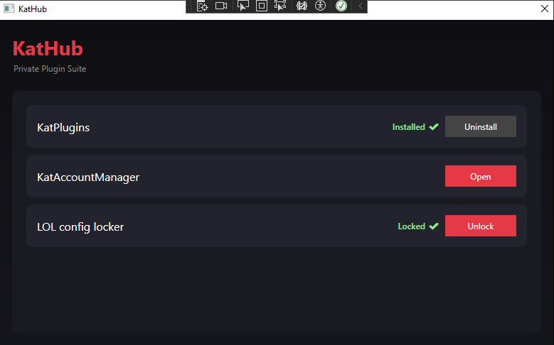

# KatHub

## Description
KatHub is an application that brings together multiple small projects into a single, easy-to-install tool. It was created out of the need to share these tools with friends who are not very familiar with computers, making everything more accessible and simple to use.



## Quick Start

### Requirements
- .NET (latest stable version recommended)
- Windows OS (for full compatibility with GUI features)

### Setup
1. Clone the repository:
   ```bash
   git clone https://github.com/yourusername/katHub.git 
2. Open the solution in Visual Studio

3. Build the project: `Build → Build Solution`

4. Run the application: `F5 or Start Debugging`

